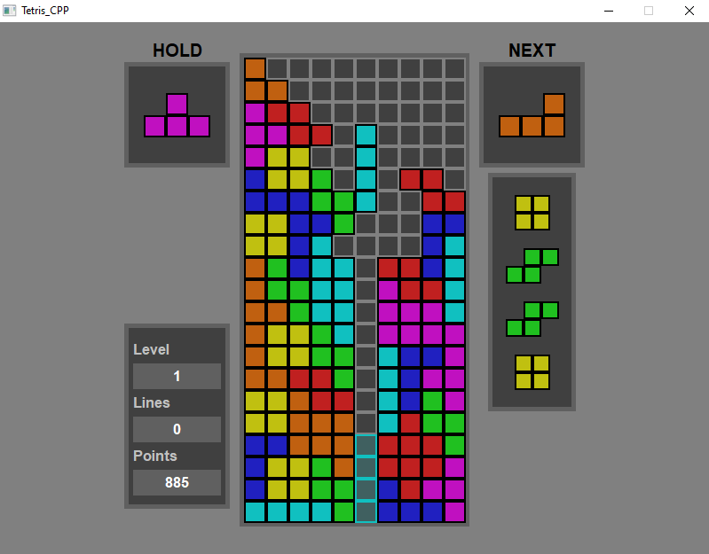

    

    

# This is my most prized project yet (WIP) #
<a href="https://github.com/OsvaldoComCH/Tetris_CPP/releases/latest">
    

      
    

</a>

<!--

  <a href="https://github.com/OsvaldoComCH">

-->
